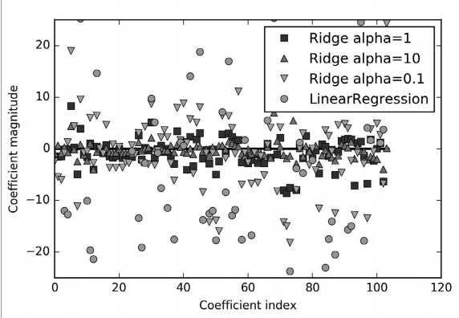
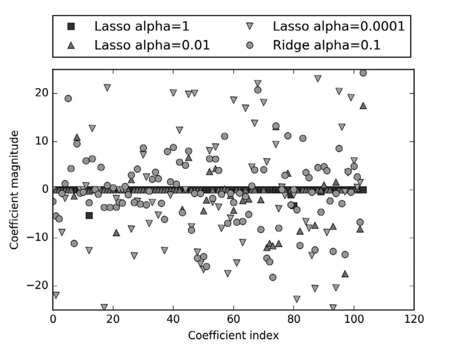

## 基础
`基本的数据都在　sklearn.datasets里`
加载数据
```python
from sklearn.datasets import load_iris   # 载入数据
iris_dataset = load_iris()
```
得到对面的keys
```python
iris_dataset.keys()
dict_keys(['data', 'target', 'target_names', 'DESCR', 'feature_names', 'filename'])
```
其中
>Descr:是对数据集进行简单说明
>target_names:赌赢的是一个字符串数组,里面是包含我们预测的结果
```python
Target names: ['setosa' 'versicolor' 'virginica']
```
>feature_names:键对应的值是一个字符串列表，对每一个特征进行了说明：
```python
print("Feature names: \n{}".format(iris_dataset['feature_names']))
Feature names:
['sepal length (cm)', 'sepal width (cm)', 'petal length (cm)',
 'petal width (cm)']
```
> target:样本的输出结果集合
>data:样本的特征集合

```python
In[15]:
print("Type of data: {}".format(type(iris_dataset['data'])))
Out[15]:
Type of data: <class 'numpy.ndarray>
#data 数组的每一行对应一个样本，列代表样本的特征测量数据
In[16]:
print("Shape of data: {}".format(iris_dataset['data'].shape))
Out[16]:
Shape of data: (150, 4)
```
`机器学习中的个体叫作样
本（sample），其属性叫作特征（feature）。data 数组的形状（shape）是样本数乘以特征
数。这是 scikit-learn 中的约定，你的数据形状应始终遵循这个约定`

`一部分数据用于构建机器学习模型，叫作训练数据（training data）或训练
集（training set）。其余的数据用来评估模型性能，叫作测试数据（test data）、测试集（test 
set）或留出集（hold-out set）。
`

`scikit-learn 中的 train_test_split 函数可以打乱数据集并进行拆分。这个函数将 75% 的
行数据及对应标签作为训练集，剩下 25% 的数据及其标签作为测试集。训练集与测试集的
分配比例可以是随意的，但使用 25% 的数据作为测试集是很好的经验法则
`
### 划分训练集和测试集
```python
from sklearn.model_selection import train_test_split
X_train, X_test, y_train, y_test = train_test_split(
 iris_dataset['data'], iris_dataset['target'], random_state=0)
```

为了确保多次运行同一函数能够得到相同的输出，我们利用 random_state 参数指定了随机
数生成器的种子。这样函数输出就是固定不变的，所以这行代码的输出始终相同。本书用
到随机过程时，都会用这种方法指定 random_state。

### 第一个预测模型
```python
# 导入
from sklearn.neighbors import KNeighborsClassifier
knn = KNeighborsClassifier(n_neighbors=1)# 设置邻居数量
knn.fit(X_train, y_train) # 给数据
# 到这里模型已经建好了,代入数据就行

X_new = np.array([[5, 2.9, 1, 0.2]])

prediction = knn.predict(X_new)
print("Prediction: {}".format(prediction))
print("Predicted target name: {}".format(
        iris_dataset['target_names'][prediction]))
Out[28]:
Prediction: [0]
Predicted target name: ['setosa']

#　做出预测
y_pred = knn.predict(X_test)
print("Test set predictions:\n {}".format(y_pred))
Out[29]:
    Test set predictions:
    [2 1 0 2 0 2 0 1 1 1 2 1 1 1 1 0 1 1 0 0 2 1 0 0 2 0 0 1 1 0 2 1 0 2 2 1 0 2]
print("Test set score: {:.2f}".format(np.mean(y_pred == y_test)))
Out[30]:
    Test set score: 0.97
#　我们还可以使用 knn 对象的 score 方法来计算测试集的精度：
print("Test set score: {:.2f}".format(knn.score(X_test, y_test)))
Out[31]:
    Test set score: 0.97
```
`scikit-learn的输入数据必须是二维数组`
### 总结
进行一次模型构建加上预测分为ｘ步
>1. 导入包 
>>+ from sklearn.neighbors import KNeighborsClassifier  
>2. 创建算法实例
>>+ knn = KNeighborsClassifier(n_neighbors=1)
>3. 导入训练集数据
>>+ knn.fit(x_train,y_train)
>4. 作出预测
>>+ y_pred = knn.predict(X_test)
>5. 评估模型
>>+ knn.score(X_test, y_test)


# 算法
只对算法的导入,参数,大致用途和注意事项做个简单的笔记,以后如果用到方便查找
具体算法如何实现的不做讨论
|算法|页数|编号|
--|--|--
K近邻|P28|algorithm-1
线性模型|P36|algorithm-2
----

## K近邻 algorithm-1

### K近邻分类
分类任务
`导入:from sklearn.neighbors import KNeighborsClassifier`
|创建参数|参数类型|作用|说明
--|--|--|--
n_neighbors|整数|设定邻居个数|在考虑多于一个邻居的情况时，我们用“投票法”（voting）来指定标签
---

### K近邻回归
回归任务
`导入:from sklearn.neighbors import KNeighborsRegressor`
|创建参数|参数类型|作用|说明
--|--|--|--
n_neighbors|整数|设定邻居个数|在使用多个近邻时，预测结果为这些邻居的平均值

###　总结

>+ 模型精度与邻居数密切相关,可以通过调整邻居数来提升模型精度
>+ 构建最近邻模型的速度通常很快，但如果训练集很大（特征数很多或者样本数很大），预测速度可能会比较慢。
>+ 使用 k-NN 算法时，对数据进行预处理是很重要的（见第 3 章）。这一算法对于有很多特征（几百或更多）的数据集往往效果不好，对于大多数特征的大多数取值都为 0 的数据集（所谓的稀疏数据集）来说，这一算法的效果尤其不好。
>+ 虽然 k 近邻算法很容易理解，但由于预测速度慢且不能处理具有很多特征的数据集，所以在实践中往往不会用到。
---

## 线性模型 algorithm-2

线性模型是在实践中广泛使用的一类模型，线性模型利用输入特征的线性函数（linear function）进行预测


### 线性回归(最小二乘法)

#### 使用
导入:from sklearn.linear_model import LinearRegression
|创建参数|参数类型|作用|说明
--|--|--|--

|算法参数/变量|类型|作用|说明
--|--|--|--
coef_|NumPy 数组|权重或者系数|也就是斜率
intercept_|浮点型|截距
`你可能注意到了 coef_ 和 intercept_ 结尾处奇怪的下划线。scikit-learn
总是将从训练数据中得出的值保存在以下划线结尾的属性中。这是为了将其
与用户设置的参数区分开。`
>+ 直线的预测能力非常受限。似乎数据的所有细节都丢失了
>+ 对于一维数据来说,欠拟合的风险很小,对于更高维的数据集（即有大量特征的数据集），线性模型将变得更加强大，过拟合的可能性也会变大。
---

### 岭回归


训练集和测试集之间的性能差异是过拟合的明显标志，因此我们应该试图找到一个可以控
制复杂度的模型。标准线性回归最常用的替代方法之一就是`岭回归`

[岭回归跟线性回归有什么区别](https://www.zhihu.com/question/28221429/answer/53858036)

#### 使用

导入:from sklearn.linear_model import Ridge
|创建参数|参数类型|作用|说明
--|--|--|--
alpha|浮点型|简单性和训练集性能二者对于模型的重要程度|增大 alpha 会使得系数更加趋向于 0，从而降低训练集性能，但可能会提高泛化性能。

*不同 alpha 值的岭回归与线性回归的系数比较*


由上图可以可以看出alpha越大特征系数的上下限就越小

|算法参数/变量|类型|作用|说明
--|--|--|--
coef_|NumPy 数组|权重或者系数|也就是斜率
intercept_|浮点型|截距
----

###  lasso
与岭回归相同，使用 lasso 也是约束系数使其接近于 0，但用到的方法不同，叫作 L1 正则化。使用 lasso 时某些系数刚好为 0。这说明某些特征被模型完全忽略。这可以看作是一种自动化的特征选择。某些系数刚好为 0，这样模型更容易解释，也可以呈现模型最重要的特征。

```python
In[36]:
    from sklearn.linear_model import Lasso
    lasso = Lasso().fit(X_train, y_train)
    print("Training set score: {:.2f}".format(lasso.score(X_train, y_train)))
    print("Test set score: {:.2f}".format(lasso.score(X_test, y_test)))
    print("Number of features used: {}".format(np.sum(lasso.coef_ != 0)))
Out[36]:
    Training set score: 0.29
    Test set score: 0.21
    Number of features used: 4
#　Lasso 在训练集与测试集上的表现都很差。这表示存在欠拟合，我们发现模型只用到了 105 个特征中的 4 个
```
#### 使用
导入:from sklearn.linear_model import Lasso
|创建参数|参数类型|作用|说明
--|--|--|--
alpha|浮点型|正则化参数|可以控制系数趋向于 0 的强度
max_iter|整数型|最大迭代次数|线性模型好像都是用梯度下降
alpha 值变小，我们可以拟合一个更复杂的模型，在训练集和测试集上的表现也更好。
但如果把 alpha 设得太小，那么就会消除正则化的效果，并出现过拟合.

*不同 alpha 值的 lasso 回归与岭回归的系数比较*

在 alpha=1 时，我们发现不仅大部分系数都是 0（我们已经知道这一点），而且其他系数也都很小。将 alpha 减小至 0.01，我们得到图中向上的三角形，大部分特征等于 0。alpha=0.0001 时，我们得到正则化很弱的模型，大部分系数都不为 0，并且还很大。为了便于比较，图中用圆形表示 Ridge 的最佳结果。alpha=0.1 的 Ridge 模型的预测性能与alpha=0.01 的 Lasso 模型类似，但 Ridge 模型的所有系数都不为 0

在实践中，在两个模型中一般首选岭回归。但如果特征很多，你认为只有其中几个是重要的，那么选择 Lasso 可能更好。同样，如果你想要一个容易解释的模型，Lasso 可以给出更容易理解的模型，因为它只选择了一部分输入特征。
###　总结
>+ 正如所预计的那样，无论是岭回归还是线性回归，所有数据集大小对应的训练分数都要高
于测试分数。由于岭回归是正则化的，因此它的训练分数要整体低于线性回归的训练分数。但岭回归的测试分数要更高，特别是对较小的子数据集。如果少于 400 个数据点，线性回归学不到任何内容。随着模型可用的数据越来越多，两个模型的性能都在提升，最终
线性回归的性能追上了岭回归。这里要记住的是，如果有足够多的训练数据，正则化变得不那么重要，并且岭回归和线性回归将具有相同的性能（在这个例子中，二者相同恰好发生在整个数据集的情况下，这只是一个巧合）。如果添加更多数据，模型将更加难以过拟合或记住所有的数据。